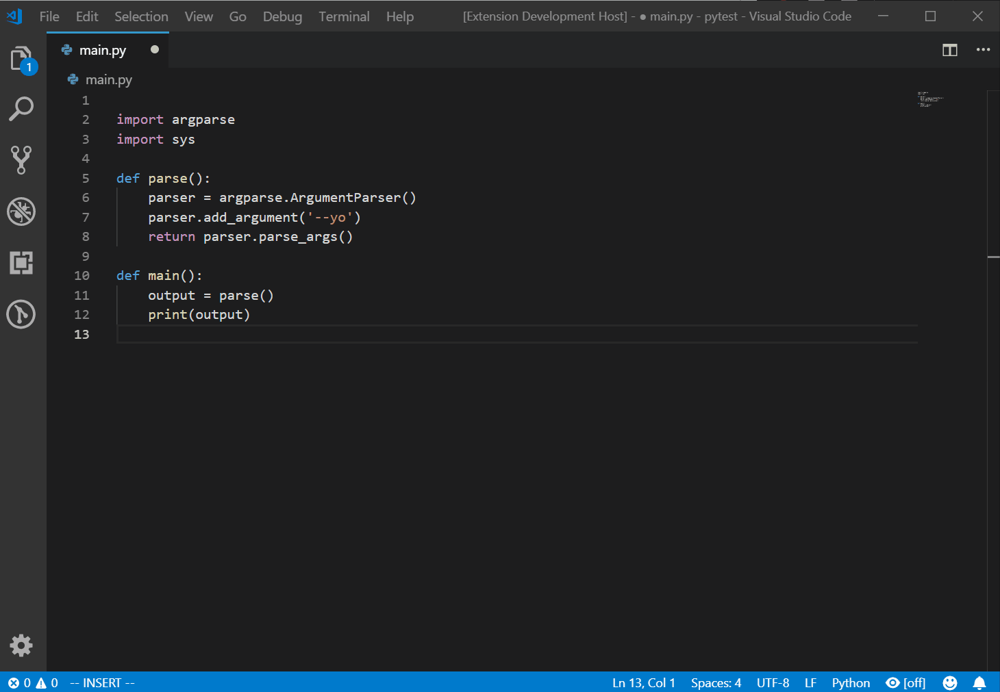

Python AST Preview in VSCode
============================

Quick and dirty way to see the AST of your active file in VSCode.

This extension uses Python's AST module to generate the AST, 
converts it to JSON and launches a new file to show you the AST.

## Features

## Requirements

Python is required.

## Extension Settings

The path to the `python` executable can be configured by configuring the following setting:

* `python-ast-preview.pythonPath`: Path to the python executable

## Known Issues

This extension is beta-ish. Feel free to create any GitHub issues for bugs or 
enhancement requests.
